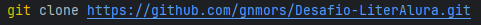
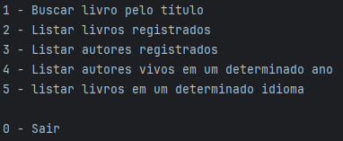

# 📚 Desafio LiterAlura 📚

---
### 🚩 G7 ONE | Java e Spring Framework | 🚩
#### 🌎 [@Alura](https://www.alura.com.br/) | [@One](https://www.oracle.com/br/) 

*📚 Desafio proposto pela alura no curso 📚*

---
### 📝 Descrição

- _O desafio proposto foi criar uma aplicação Spring Boot onde seja possivel realizar pesquisas por livros._
- _A API utilizada para essa busca foi `gutendex.com`._
- _Fazer operações, persistência e exibição de dados._ 

### 🛠️ Uso 

- _Utilize o git clone e execute o projeto, para que tudo funcione corretamente será necessário também gerar o próprio servidor `Postgres` e configurar corretamente em `src="src/resources/application.properties`._

 > 

### 📋 Funcionalidades

- _Pesquisar livros disponíveis no Gutendex;_
- _Persistir dados de livros e autores pesquisados;_
- _Apresentar os dados persistidos ao usuário;_
- _Filtrar autores vivos em determinado ano e livros com uma linguagem específica._

> 